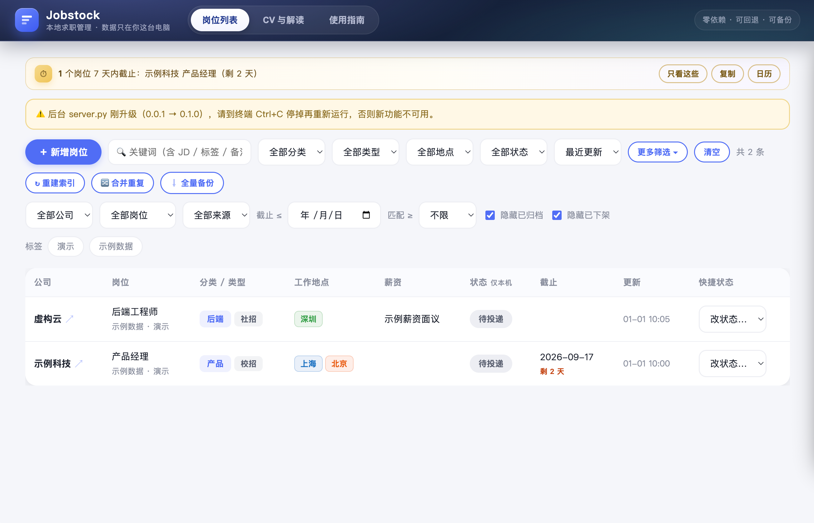
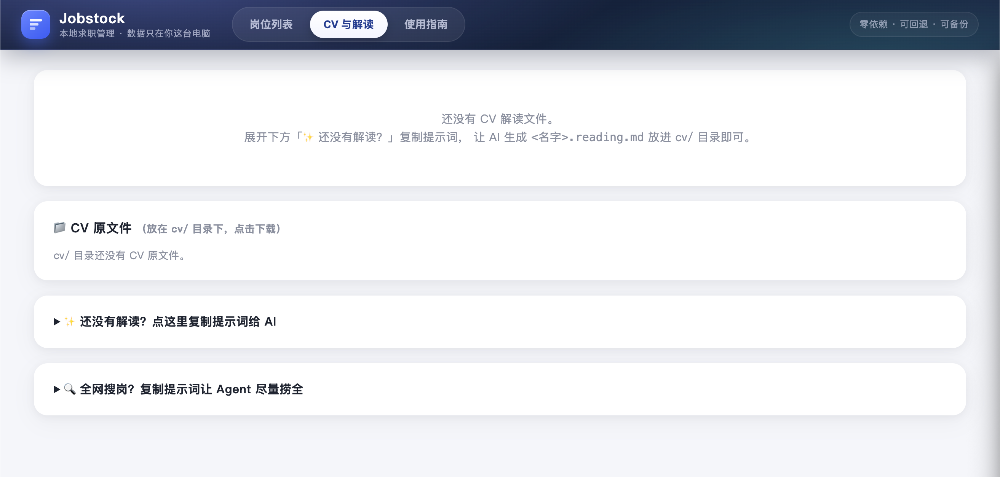

# Jobstock

**一个为中文求职场景设计的本地求职 Dashboard。**

把岗位、截止日期、投递进度、面试状态和备注放在一个页面里管理。**不注册账号、不上传简历、不依赖云服务**，数据默认只保存在你的电脑上。

适合校招 / 实习 / 社招，以及同时投很多公司、需要长期整理岗位的人。

- 🖥️ **本地优先**：岗位、投递状态、CV 都留在本机
- ⚡ **零第三方依赖**：Python 标准库 + 原生 HTML/JS，不需要 npm / pip install
- 🍎🪟 **Windows / macOS 可用**：安装后可双击启动
- 📋 **一页管理求职流程**：待投递 → 已投递 → 笔试 → 面试 → Offer
- ⏰ **截止日期提醒**：可复制 Markdown，也可导出 `.ics` 日历
- 🤖 **Agent 友好**：Claude Code / Codex / Cursor 等可直接帮你初始化、搜岗和写入岗位
- 🧯 **有后悔药**：岗位历史版本、个人状态快照、zip 备份

### 界面预览

**岗位列表** — 一页看清城市、类型、截止与投递状态；顶部浅琥珀条汇总近 7 天截止（可只看这些 / 复制 / 导出日历）



**CV 与解读** — 放入简历后复制提示词，让 Agent 生成关键词解读与搜岗计划



---

## 60 秒开始

运行 Jobstock 只需要 **Python 3.8+**。

### 方法 A：不会 Git，直接下载 ZIP

1. 在 GitHub 页面点击 **Code → Download ZIP**
2. 解压后进入 `Jobstock` 文件夹
3. 运行：

```bash
python install.py
```

macOS 如果没有 `python` 命令：

```bash
python3 install.py
```

安装时不知道怎么选，**一路回车即可**。

### 方法 B：会 Git

```bash
git clone https://github.com/Ychris12138/Jobstock.git
cd Jobstock
python install.py
```

安装完成后：

| 系统 | 启动方式 |
|---|---|
| Windows | 双击 `start.bat` |
| macOS | 双击 `start.command` |
| 通用 | `python server.py` / `python3 server.py` |

浏览器会自动打开本地页面，默认地址为 `http://localhost:8770`。

---

## 🤖 让 Agent 帮你安装（推荐）

如果你已经在用 Claude Code、Codex、Cursor 或其他 Coding Agent，直接把下面这段发给它即可：

```text
请帮我安装并初始化 Jobstock：
https://github.com/Ychris12138/Jobstock

安装策略：
1. 先检测本机是否有 Git；
2. 如果 Git 可用且可以正常访问 GitHub，就 git clone 仓库；
3. 如果没有 Git，或 clone 失败，就下载：
   https://github.com/Ychris12138/Jobstock/archive/refs/heads/main.zip
   解压后进入项目目录；
4. 阅读 README.md 和 AGENTS.md；
5. 使用默认配置运行 install.py --yes；
6. 运行 test_server.py，确认测试通过；
7. 启动本地 WebUI；
8. 不上传、提交或同步我的 CV、岗位数据、投递状态和 config.json；
9. 完成后告诉我安装目录和以后怎么启动。
```

**Agent 只需要记住一条安装逻辑：Git 能用就 clone，不能用就下载 ZIP。** 不需要为了安装 Jobstock 额外配置 Git。

> Jobstock 本身不会上传你的 CV 或求职数据；如果让外部 Agent 阅读 CV，数据处理方式取决于你所使用的 Agent / 模型服务。

---

## 第一次打开后做什么？

最简单的使用方式只有三步：

1. 点 **「＋ 新增岗位」**，录入公司和岗位
2. 投递后更新 **投递状态**，写自己的备注
3. 定期点 **「⇩ 全量备份」** 保存一份 zip

如果你已经有 CV，可以把文件放进 `cv/`，然后在 **「CV 与解读」** 页面复制内置提示词，让 Agent 帮你生成关键词解读和搜岗计划。

---

## 现在能做什么？

| 功能 | 说明 |
|---|---|
| 岗位库 | 公司、岗位、职位号、城市、薪资、链接、截止日期、JD、标签 |
| 投递管理 | 待投递 / 已投递 / 笔试 / 面试 / Offer / 已拒绝 / 已归档 |
| 搜索筛选 | 公司、分类、城市、招聘类型、状态、来源、标签、全文关键词 |
| 截止提醒 | 7 天内截止、已过期、Markdown 复制、`.ics` 日历导出 |
| CV 关键词命中 | 根据 `cv/` 中的关键词解读显示简单命中数，方便排序筛选 |
| 去重 | 同职位号 / 同链接拦截，重复岗位可合并 |
| 历史版本 | 岗位保留最近 3 份历史；个人状态保留最近 10 份快照 |
| 本地备份 | 一键导出岗位 + 历史 + 投递状态；**不包含 CV 原文件** |
| Agent 协作 | 内置初始化、CV 解读、全网搜岗提示词 |

> 「CV 关键词命中」只是可解释的关键词统计，不是黑盒 AI 评分，也不代表录取概率。

---

## 为什么适合和 AI Agent 一起用？

很多求职工具把 AI 做成一个聊天框；Jobstock 更希望 **Agent 直接维护你的求职资料库，而不是替你保存个人进度**。

Agent 可以：

- 根据 CV 和求职方向批量搜索岗位
- 按统一字段整理公司、岗位、JD、城市、截止日期
- 自动检查重复岗位
- 更新 `jobs/*.json` 后重建索引
- 找出快截止但还没投的岗位

同时，**岗位信息和个人投递状态是分开的**：Agent 可以整理岗位情报，但不会因为批量改岗位而覆盖你的个人备注和投递时间线。

WebUI 已内置三套提示词：

- **初始化提示词**：准备你的求职工作区
- **CV 解读提示词**：生成固定格式的关键词解读
- **全网搜岗提示词**：按方向尽量多地收集候选岗位

---

## 数据放在哪里？

```text
jobs/<id>.json      岗位信息
local/status.json   你的投递状态、备注和时间线
data/jobs.db        可随时重建的 SQLite 索引
cv/                 CV 与解读
config.json         本机配置
```

这些个人数据默认都被 `.gitignore` 排除：

- `jobs/`
- `local/`
- `cv/`（仅保留说明文件）
- `config.json`
- SQLite 索引

正常使用时，不会因为 `git add .` 就把 CV 或投递记录直接提交出去。公开 fork / 修改仓库前，仍建议先看一眼 `git status`。

### 为什么岗位信息和个人状态分开？

| | 岗位层 | 个人层 |
|---|---|---|
| 内容 | 公司、岗位、JD、链接、截止日期 | 投递到哪一步、个人备注、时间线 |
| 位置 | `jobs/*.json` | `local/status.json` |
| Agent 可批量维护 | ✅ | 默认不应该 |

这是 Jobstock 最重要的数据设计之一。

---

## 数据目录可以放到别的地方

默认数据就在 Jobstock 目录中。如果想放在文档盘、移动硬盘或其他目录：

```bash
python install.py --data-dir "D:\jobs-data" --cv-dir "~/Documents/my-cv"
```

配置会写进本机的 `config.json`。

---

## 使用时记住三件事

**1. 尽量填写官方职位号 `job_no`**  
它是最可靠的去重信号；没有职位号时才依赖链接和岗位名判断。

**2. 岗位下架 ≠ 你不想投**  
岗位停止招聘用 `closed`；你自己决定不投用「已归档」。

**3. 页面里的“全量备份”不包含 CV**  
这样可以减少简历被意外复制出去的风险。换电脑时记得单独带走 `cv/`。

---

<details>
<summary><strong>给 Agent / 开发者：数据约定</strong></summary>

完整规则见 [`AGENTS.md`](AGENTS.md)。最重要的几条：

- Agent 写岗位时只修改岗位层字段
- 不把 `status` / `my_notes` / `history` 写进岗位 JSON
- 修改岗位文件后运行 `python server.py --reindex`
- 城市放 `locations[]`，招聘类型放 `recruit_type`
- 不直接修改 SQLite
- 不手改或清空 `jobs/.history/`
- 删除文件前先征得用户同意

</details>

<details>
<summary><strong>API</strong></summary>

| 方法 | 路径 | 说明 |
|---|---|---|
| GET | `/api/jobs` | 岗位列表、筛选项、截止统计、CV 关键词 |
| GET | `/api/jobs/<id>` | 单条岗位 |
| POST | `/api/jobs` | 新增岗位 |
| PUT | `/api/jobs/<id>` | 修改岗位（使用 `base_rev` 乐观锁） |
| POST | `/api/jobs/<id>/status` | 修改本机投递状态 |
| POST | `/api/reindex` | 重建索引 |
| POST | `/api/dedupe` | 合并强信号重复岗位 |
| GET | `/api/backup` | 导出岗位 + 历史 + 投递状态 zip（不含 CV） |
| GET | `/api/cv` | CV 文件与解读 |
| GET | `/api/prompts` | 初始化 / 搜岗 / CV 解读提示词 |

</details>

<details>
<summary><strong>开发 / 自测</strong></summary>

```bash
python test_server.py
```

测试使用临时目录，不会碰真实岗位和投递数据。CI 会在 Ubuntu 和 Windows 上自动跑同一套测试。

项目坚持 **零第三方运行时依赖**：Python 标准库 + 原生 JavaScript，不需要 npm 构建。

</details>

---

## 当前版本

**v0.1.0**

Jobstock 仍处于早期版本。WebUI 顶栏有「使用指南」页（三步上手、Agent 提示词、分类定制）。
如果你遇到安装、数据迁移、岗位格式或 Agent 协作问题，欢迎提交 Issue。
